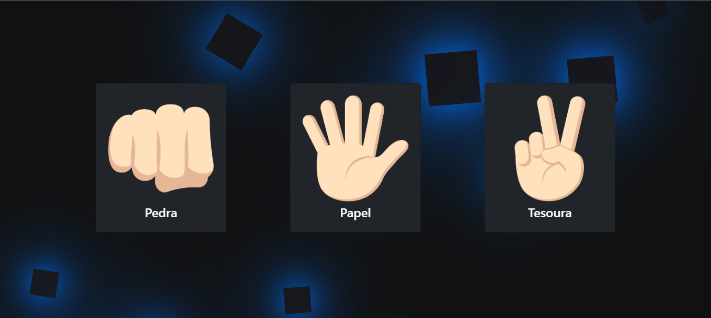

# Jokenpô - Pedra, Papel e Tesoura

Um jogo clássico de Jokenpô (Pedra, Papel e Tesoura) feito com HTML, CSS e JavaScript. O jogador desafia a CPU e acompanha o placar em tempo real.

> ✅ **Sistema de score implementado com sucesso** 🏁 **Projeto finalizado por enquanto**

## 🚀 Demonstração

➡️ Acesse o jogo online: [https://philcard.github.io/JokenPo/](https://philcard.github.io/JokenPo/)

## 📸 Imagens
<div align="start">
  
</div>

## 🎮 Como Funciona

1. O jogo inicia com uma **tela splash** animada mostrando as sílabas **"Jo-Ken-Pô"**.
2. Após isso, são exibidos os **botões e interface principal**.
3. Ao clicar em **Start**, são mostradas **3 cartas**: Pedra 🪨, Papel 📄 e Tesoura ✂️.
4. O jogador escolhe uma carta e a CPU faz uma escolha aleatória.
5. O resultado (Vitória, Derrota ou Empate) é mostrado:
   - Atualiza o **placar**.
   - Exibe as cartas escolhidas pelo jogador e pela CPU.

---

## 🛠️ Tecnologias Usadas

- HTML5
- CSS3 (com animações)
- Bootstrap
- JavaScript (lógica do jogo)

---

## 📦 Funcionalidades Concluídas

- ✅ Tela splash animada
- ✅ Interface com botões e cartas
- ✅ Sistema de placar
- ✅ Sistema de score persistente (armazenado com `localStorage`)

---

## 🧩 Como Rodar Localmente

```bash
# Clone este repositório
git clone https://github.com/PhilCard/JokenPo.git

# Acesse a pasta
cd jokenpo

# Abra o index.html em seu navegador
